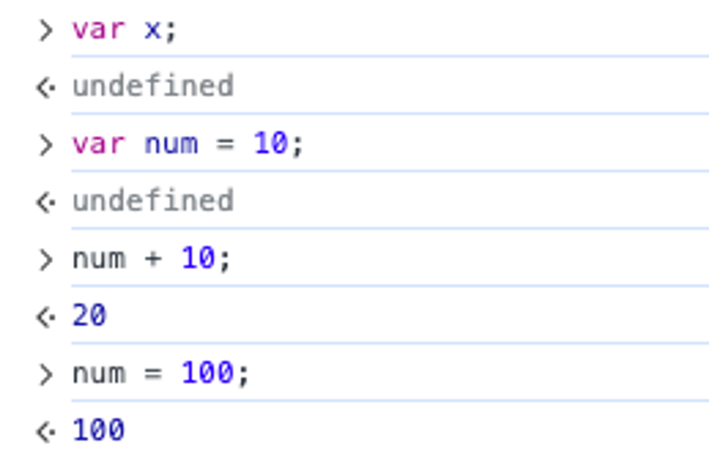

# 5장 표현식과 문

## 5.1 값

---

**값은 식(표현식 expression)이 평가되어 생성된 결과를 말한다.** 평가란 식을 해석해서 값을 생성하거나 참조하는 것을 의미한다.

```jsx
// 10 + 20은 평가되어 숫자 값 30을 생성한다.
10 + 20;
```

변수는 하나의 값을 저장하기 위해 확보한 메모리 공간 자체 또는 그 메모리 공간을 식별하기 위해 붙인 이름이다.

변수에 할당되는 것은 값이다.

```jsx
// 변수에는 10 + 20이 평가되어 생성된 숫자 값 30이 할당된다.
var sum = 10 + 20;
```

## 5.2 리터럴

---

리터럴(Literal)은 사람이 이해할 수 있는 문자 또는 **약속된** 기호를 사용해 값을 생성하는 표기법을 말한다.

Ex) 아라비아 숫자, 미리 약속된 기호(’’, “”, ., [], // 등)

자바스크립트 엔진은 코드가 실행되는 시점인 런타임에 리터럴을 평가해 값을 생성한다.

## 5.3 표현식

---

표현식은 **값으로 평가될 수 있는 문**이다. 즉, **표현식이 평가되면 새로운 값을 생성하거나 기존 값을 참조**한다.

```jsx
var score = 100;

// 리터럴 표현식
10;
("Hello");

// 식별자 표현식
sum;
person.name;
arr[1];

// 연산자 표현식
10 + 20;
sum = 10;
sum != 10;

// 함수/메서드 호출 표현식
square();
person.getName();
```

## 5.4 문

---

- 프로그램을 구성하는 기본 단위이자 **최소 실행 단위**
- 여러 토큰으로 구성
  - 토큰
    - 문법적인 의미를 가지며, 문**법적으로 더 이상 나눌 수 없는** 코드의 기본 요소를 의미
    - `키워드(var)`, `식별자(num)`, `연산자(=)`, `리터럴(+)`, `세미콜론(;)`이나 `마침표(.)`
- 선언문, 할당문, 조건문, 반복문

## 5.5 세미콜론과 세미콜론 자동 삽입 기능

---

문의 끝에 붙이는 세미콜론은 옵션이다. = 생략 가능하다

세미콜론 자동 삽입 기능이 암묵적으로 수행되어 자바스크립트 엔진이 소스코드를 해석할 때 문의 끝이라고 예측되는 지점에 세미콜론을 자동으로 붙여준다.

자바스크립트 엔진은 문의 끝이라고 예측되는 지점에 세미콜론을 자동으로 붙이는 세미콜론 자동 삽입 기능이 있어 옵션으로 사용해도 되지만, 개발자의 예측과 다르게 엔진이 실행될 수도 있기 때문에 붙이는 것을 권장한다.

## 5.6 표현식인 문과 표현식이 아닌 문

---

<aside>
💡 **표현식인 문과 표현식이 아닌 문 구별하는 방법 ⇒ 변수에 할당하기!!**

</aside>

```jsx
// 변수 선언문은 값으로 평가될 수 없으므로 표현식이 아니다.
var x;
// 1, 2, 1 + 2, x = 1 + 2는 모두 표현식이다.
// x = 1 + 2는 표현식이면서 완전한 문이기도 하다.
x = 1 + 2;
```

- 표현식인 문: 값으로 평가 될 수 있음
  - 변수 할당문
- 표현식이 아닌 문: 값으로 평가될 수 없음
  - 변수 선언문

```jsx
// 표현식이 아닌 문은 값처럼 사용 할 수 없다.
var foo = var x; // SyntaxError
```

```jsx
// 변수 선언문은 표현식이 아닌 문이다.
var x;
// 할당문은 그 자체가 표현식이지만 완전한 문이기도 하다. (표현식인 문)
x = 100;

var foo = (x = 100);
console.log(foo); // 100
```

<aside>
💡 완료값

크롬 개발자 도구에서 표현식이 아닌 문을 실행하면 언제나 undefined가 출려되며 이를 완료 값이라고 한다. 완료 값은 표현식의 평가 결과가 아니다. 다른 값과 같이 변수에 할당할 수 없고 참조할 수도 없다.


</aside>
