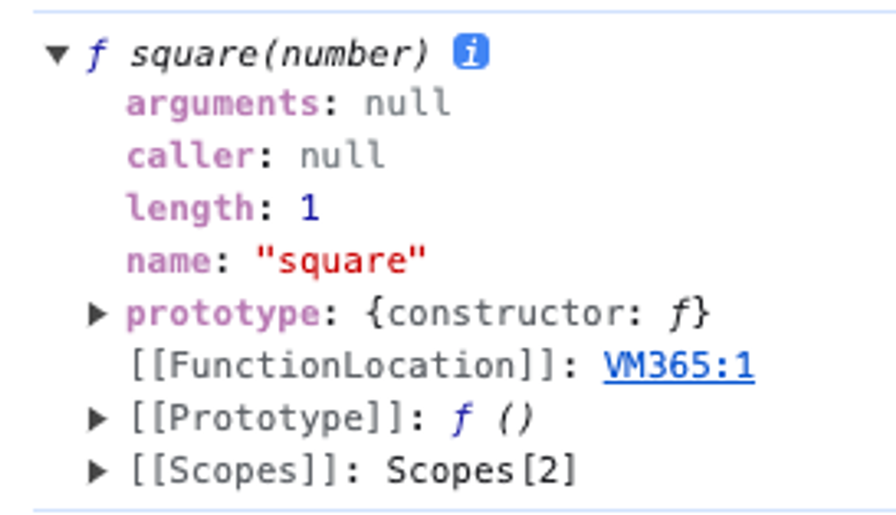
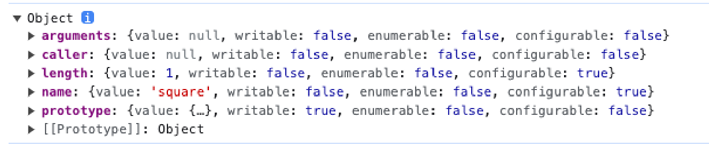

# 18장 일급 객체

## 일급 객체

---

다음과 같은 조건을 만족하는 객체를 `일급 객체`라고 한다.

1. 무명의 리터럴로 생성할 수 있다. 즉, 런타임에 생성이 가능하다.
2. 변수나 자료구조(객체, 배열 등)에 저장할 수 있다.
3. 함수의 매개변수에 전달할 수 있다.
4. 함수의 반환값으로 사용할 수 있다.

```jsx
// 1. 무명의 리터럴로 생성할 수 있다. 즉, 런타임에 생성이 가능하다.
// 2. 함수는 변수에 저장할 수 있다.
function increase = function (num) {
	return ++num;
}

// 2. 함수는 객체에 저장할 수 있다.
const auxs = { increase };

// 3. 함수의 매개변수에 전달할 수 있다.
// 4. 함수의 반환값으로 사용할 수 있다.
function makeCounter(aux) {
	let num = 0;

	return function () {
		num = aux(num);
		return num;
	};
}

// 3. 함수의 매개변수에 전달할 수 있다.
const increaser = makeCounter(auxs.increase);
console.log(increaser());  // 1
console.log(increaser());  // 2
```

→ 함수를 객체와 동일하게 사용할 수 있다는 의미

→ 일반 객체는 호출할 수 없지만 함수 객체는 호출할 수 있다.

## 함수 객체의 프로퍼티

---

함수는 객체이며 프로퍼티를 가질 수 있다.

```jsx
function square(number) {
  return number * number;
}

console.dir(square);
```


함수 객체의 프로퍼티

```jsx
function square(number) {
  return number * number;
}

console.dir(Object.getOwnPropertyDescriptors(square));
console.log(Object.getOwnPropertyDescriptor(square, "__proto__")); // undefined
// square 함수는 Object.prototype 객체로부터 __proto__ 접근자 프로퍼티를 상속받는다.
```



arguments, caller, length, name, prototype 프로퍼티는 모두 함수 객체의 데이터 프로퍼티이다.

**proto** 는 접근자 프로퍼티이며, 함수 객체 고유의 프로퍼티가 아니라 Object.prototype 객체의 프로퍼티를 상속 받는다.

### arguments 프로퍼티

---

- 전달된 인수들의 정보를 담고 있는 `순회` 가능한 `유사 배열 객체`
- 함수 내부에서 지역 변수 처럼 사용 (함수 외부에서 참조 x)
- ES3부터 폐지
- 함수의 매개변수와 인수의 개수가 일치하는지 확인하지 않는다.
  - 인수가 전달되지 않은 매개변수는 `undefined`로 초기화
  - 매개변수의 개수보다 인수를 더 많이 전달한 경우 `초과된 인수` `무시`(암묵적으로 arguments 객체의 프로퍼티로 보관)
- 배열 메서드를 사용할 경우 `Function.prototype.cal`l, `Function.prototype.apply`를 사용해 간접 호출해야 함

```jsx
function sum() {
  // argumnets 객체를 배열로 반환
  const array = Array.prototype.slice.call(arguments);
  return array.reduce(function (pre, cur) {
    return pre + cur;
  }, 0);
}

console.log(sum(1, 2)); // 3
cosole.log(sum(1, 2, 3, 4, 5)); // 15
```

ES6에서는 `Rest 파라미터` 도입

```jsx
// ES6 Rest Parameter
function sum(...args) {
  return args.reduce((pre, cur) => pre + cur, 0);
}

console.log(sum(1, 2)); // 3
console.log(sum(1, 2, 3, 4, 5)); // 15
```

### length 프로퍼티

---

매개변수의 개수를 가리킴

### name 프로퍼티

---

```jsx
// 기명 함수 표현식
var namedFunc = function foo() {};
console.log(namdedFunc.name); // foo

// 익명 함수 표현식
var anonymousFunc = function () {};
console.log(anonymousFunc.name); // anonymousFunc

// 함수 선언문
function bar() {}
console.log(bar.name); // bar
```

### **proto** 접근자 프로퍼티

---

### prototype 프로퍼티

---

constructor만이 소유하는 프로퍼티
