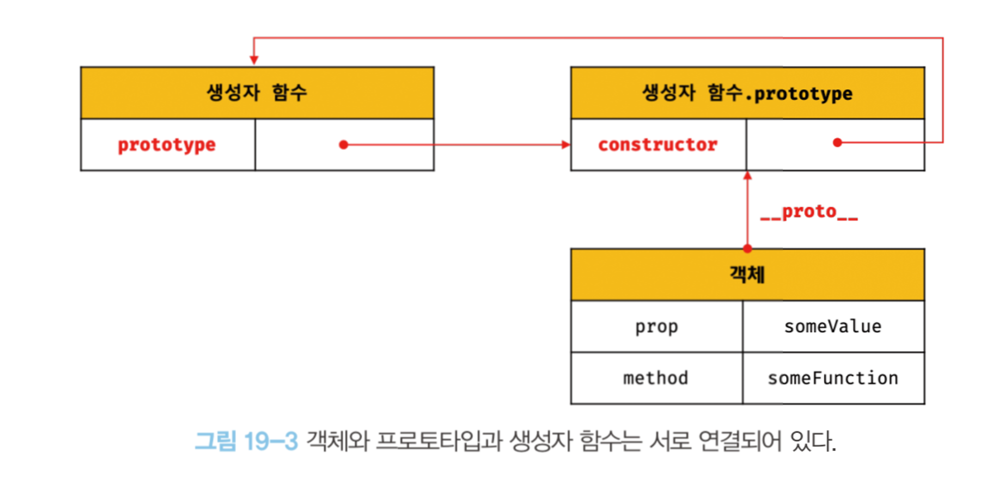
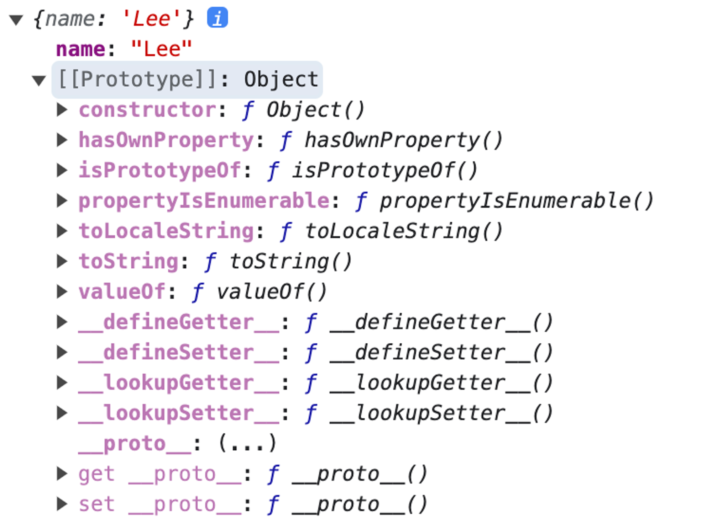

# 19장 프로토타입

자바스크립트는 `프로토타입 기반의 객체지향 프로그래밍 언어`로, 거의 모든 값이 `객체`로 이루어져있으며 `원시 타입 값을 제외`한 나머지 값들(함수, 배열, 정규 표현식 등)은 모두 객체다.

## 객체지향 프로그래밍

---

객체지향 프로그래밍은 프로그램을 `여러 독립적인 객체의 집합`으로 표현하는 프로그래밍 패러다임을 나타내며, 이는 `실세계의 사물이나 개념`을 `속성`을 통해 `인식`하거나 `구별`하는 철학적 사고를 프로그래밍에 적용한 접근 방식이다.

ex) 사람은 이름, 주소, 성별, 나이, 신장, 체중, 학력, 성격, 직업 등 다양한 속성을 갖으며, 속성을 구체적으로 표현하면 각 사람을 구별하여 인식할 수 있다.

위와 같은 예시를 프로그래밍에 접목시킬 경우, `**추상화(abstraction)**`를 통해 다양한 속성 중에 `필요한 속성`만을 간추려 내어 `표현`할 수 있다.

[**“이름”**과 **“주소”**라는 속성을 갖는 person이라는 객체를 자바스크립트로 표현]

```jsx
// 이름과 주소 속성을 갖는 객체
const person = {
  name: "Lee",
  address: "Seoul",
};

console.log(person); // {name: 'Lee', address: 'Seoul'}
```

이름과 주소 속성으로 표현된 `객체인 person`을 `다른 객체와 구별`하여 `인식`할 수 있다. 이처럼 `**객체**`는 **`속성`을 통해 여러 개의 값을 `하나의 단위`로 구성한 복합적인 자료구조**이다.

ex) 원이라는 개념을 객체로 만들어보기

- 속성: 반지름 (원의 상태를 나타내는 데이터)
- 동작: 원의 지름, 둘레, 넓이 구하기 (속성을 갖고 구할 수 있다.)

```jsx
const circle = {
	radius: 5, // 반지름
}

// 원의 지름: 2r
getDiameter() {
	return 2 * this.radius;
},

/// ...
```

객체지향 프로그래밍은 `**객체의 상태를 나타내는 데이터**`와 `**상태 데이터를 조작할 수 있는 동작**`을 하나의 논리적인 단위로 묶어 생각한다.

> 💡 객체의 `**상태 데이터**`를 **`프로퍼티`**, `**동작**`을 **`메서드`**라 부른다.

## 상속과 프로토타입

---

상속은 객체지향 프로그래밍의 핵심 개념으로, 어떤 객체의 `프로퍼티` 또는 `메서드`를 다른 객체가 `상속`받아 그대로 사용할 수 있는 것을 말한다.

**[생성자 함수]** - 동일한 프로퍼티 구조를 갖는 객체를 여러 개 생성할 때 유용

```jsx
// 생성자 함수
function Circle(radius) {
  this.radius = radius;
  this.getArea = function () {
    // Math.PI는 원주율을 나타내는 상수다.
    return Math.PI * this.radis ** 2;
  };
}

// 반지름이 1인 인스턴스 생성
const circle1 = new Circle(1);

// 반지름이 2인 인스턴스 생성
const circle2 = new Circle(2);

// Circle 생성자 함수는 인스턴스를 생성할 때마다 동일한 동작을 하는
// getArea 메서드를 중복 생성하고 모든 인스턴스가 중복 소유한다.
// getArea 메서드는 하나만 생성하여 모든 인스턴스가 공유해서 사용하는 것이 바람직하다.
console.log(circle1.getArea === circle2.getArea); // false
```

동일한 생성자 함수에 의해 생성된 모든 인스턴스가 `동일한 메서드`를 `중복 소유`하는 것은 `메모리를 불필요하게 낭비`한다.

**[프로토타입 기반 상속]**

```jsx
// 생성자 함수
function Circle(radius) {
  this.radius = radius;
}

// Circle 생성자 함수가 생성한 모든 인스턴스가 getArea 메서드를
// 공유헤서 사용할 수 있도록 프로토타입에 추가한다.
// 프로토타입은 Circle 생성자 함수의 prototype 프로퍼티에 바인딩되어 있다.
Circle.prototype.getArea = function () {
  return Math.PI * this.radis ** 2;
};

// 인스턴스 생성
const circle1 = new Circle(1);
const circle2 = new Circle(2);

// 생성자 함수가 생성하는 모든 인스턴스는 하나의 getArea메서드를 공유한다.
console.log(circle1.getArea === circle2.getArea); // true
```

Circle 생성자 함수가 생성한 `인스턴스`는 `Circle.prototype`의 모든 `프로퍼티`와 `메서드`를 `상속`받는다. getArea 메서드는 하나만 생성되어 Circle.prototype의 메서드로 할당되며, Circle 생성자 함수가 생성하는 모든 인스턴스가 getArea 메서드를 상속받아 공유하여 사용한다.

반면, 자신의 상태를 나타내는 radius 프로퍼티는 개별로 소유하고 이를 공유하지 않는다.

## 프로토타입 객체

---

`프로토타입 객체`란 객체지향 프로그래밍의 근간을 이루는 `객체 간 상속`을 구현하기 위해 사용된다.

객체는 내부 슬롯인 `[[Prototype]]`을 가지며, 이 값은 해당 `객체의 프로토타입`을 가리킨다. 프로토타입은 `객체 생성 방식`에 따라 결정되며, 모든 `객체`는 `하나의 프로토타입`을 갖고 있으며 이는 `생성자 함수와 연결`된다.



`[[Prototype]]`에 직접 접근할 수 없지만, `__proto__ 접근자 프로퍼티`를 통해 간접적으로 자신의 `프로토타입`에 `접근`할 수 있다. 프로토타입은 `constructor 프로퍼티`를 통해 `생성자 함수에 접근`할 수 있고, `생성자 함수`는 `프로토타입 프로퍼티`를 통해 `프로토타입에 접근`할 수 있다.

### 19.3.1 **proto** 접근자 프로퍼티

---

모든 객체는 `__proto__ 접근자 프로퍼티`를 통해 자신의 프로토타입, 즉 `[[Prototype]]` 내부 슬롯에 간접적으로 `접근`할 수 있다.

```jsx
const person = { name: "Lee" };
```



\***\*proto**는 접근자 프로퍼티다.\*\*

<aside>
💡 **`접근자 프로퍼티`**
값을 직접 가지지 않고, 데이터 프로퍼티의 값을 읽거나 저장하기 위한 접근자 함수인 [[Get]]과 [[Set]] 프로퍼티 어트리뷰트로 이루어진 프로퍼티이다.

</aside>

`__proto__`는 `getter/setter 함수`라고 부르는 접근자 함수([[Get]], [[Set]] 프로퍼티 어트리뷰트에 할당된 함수)를 통해 `프로토타입`을 `취득`하거나 `할당`한다.

```jsx
const obj = {};
const parent = { x: 1 };

// getter 함수인 get __proto__가 호출되어 obj 객체의 프로토타입을 취득
obj.__proto__;

// setter 함수인 set __proto__가 호출되어 obj 객체의 프로토타입을 교체
obj.__proto__ = parent;

console.log(obj.x); // 1
```

> 💡 _proto_ 접근자 프로퍼티를 통해 프로토타입에 접근하면 getter 함수인 get이 호출된다.
> **proto** 접근자 프로퍼티를 통해 새로운 프로토타입을 할당하면 setter 함수인 set이 호출된다.

\***\*proto** 접근자 프로퍼티는 상속을 통해 사용된다.\*\*

> 💡 **`__proto__ 접근자`**
> 객체가 직접 소유하는 프로퍼티가 아니라 `Object.prototype의 프로퍼티`다.

```jsx
const person = { name: "Hyun" };

// person 객체는 __proto__ 프로퍼티를 소유하지 않는다.
console.log(person.hasOwnProperty("__proto__")); // false

// __proto__ 프로퍼티는 모든 객체의 프로토타입 객체인 Object.prototype의 접근자 프로퍼티다.
console.log(Object.getOwnPropertyDescriptor(Object.prototype, "__proto__"));

// 모든 객체는 Object.prototype의 접근자 프로퍼티 __proto__를 상속받아 사용할 수 있다.
console.log({}.__proto__ === Object.prototype); // true
```

\***\*proto** 접근자 프로퍼티를 통해 프로토타입에 접근하는 이유\*\*

`상호 참조`에 의해 `프로토타입 체인이 생성`되는 것을 `방지`하기 위해서다.

```jsx
const parent = {};
const child = {};

// child의 프로토타입을 parent로 설정
child.__proto__ = parent;

// parent의 프로토타입을 child로 설정
parent.__proto__ = child; // TypeError: Cyclic __proto__ value
```

프로토타입 체인은 `단방향 링크드 리스트`로 구현되어야 하며, 프로퍼티를 검색할 때 `순환 참조`로 인한 `무한 루프를 방지`하기 위해 `__proto__` 접근자 프로퍼티를 통해 `프로토타입`에 `접근`하고 `교체`하도록 구현되어있다.

\***\*proto** 접근자 프로퍼티를 코드 내에서 직접 사용하는 것은 권장하지 않는다.\*\*

모든 객체가 **proto** 접근자 프로퍼티를 사용할 수 있는 것이 아니기 때문이다.

```jsx
// obj는 프로토타입 체인의 종점이다. 따라서 Object.__proto__를 상속받을 수 없다.
const obj = Object.create(null);

console.log(obj.__proto__);

// __proto__ 보다 Object.getPrototypeOf 메서드를 사용하는 편이 좋다.
console.log(Object.getPrototypeOf(obj)); // null
```

따라서 프로토타입의 `참조를 취득`하고 싶은 경우에는 `Object.getPrototypeOf` 메서드를 사용하고, 프로토타입을 `교체`하고 싶은 경우에는 `Object.setPrototypeOf` 메서드를 사용할 것을 권장한다.

### 함수 객체의 prototype 프로퍼티

---

`함수 객체`만 `소유`하는 `prototype 프로퍼티`는 생성자 함수가 생성할 `인스턴스의 프로토타입을 가리킨다.`

```jsx
// 함수 객체는 prototype 프로퍼티를 소유한다.
(function () {}).hasOwnProperty("prototype"); // true

// 일반 객체는 prototype 프로퍼티를 소유하지 않는다.
({}).hasOwnProperty("prototype"); // false
```

non-constructor인 `화살표 함수`와 ES6 `메서드 축약 표현`은 prototype 프로퍼티를 소유하지 않으며 프로토타입도 생성하지 않는다.

```jsx
// 화살표 함수
const Person = (name) => {
  this.name = name;
};

// 메서드의 축약 표현
const obj = {
  foo() {},
};
```

`일반 함수`도 `prototype 프로퍼티`를 `소유`하지만, 객체를 생성하지 않는 이 `prototype 프로퍼티는 의미가 없다.` 모든 객체가 가지고 있는 `__proto__접근자 프로퍼티`와 함수 객체만이 가지고 있는 `prototype 프로퍼티`는 결국 `동일한` `프로토타입`을 가리키지만, `사용하는 주체`가 `다르다.`

| 구분 | 소유 | 값  | 사용 주체 | 사용 목적 |
| ---- | ---- | --- | --------- | --------- |

| **proto**
접근자 프로퍼티 | 모든 객체 | 프로토타입의 참조 | 모든 객체 | 객체가 자신의 프로토타입에 접근 또는 교체하기 위해 사용 |
| prototype
프로토타입 | constructor | 프로토타입의 참조 | 생성자 함수 | 생성자 함수가 자신이 생성할 객체(인스턴스)의 프로토타입을 할당하기 위해 사용 |

```jsx
// 생성자 함수
function Person(name) {
  this.name = name;
}

const me = new Person("Lee");

//동일한 프로토타입을 가리킨다
console.log(Person.prototype === me.__proto__); // true
```

### 프로토타입의 constructor 프로퍼티와 생성자 함수

---

모든 `프로토타입은` `constructor` 프로퍼티를 가지며, 이 프로퍼티는 자신을 `참조`하고 있는 `생성자 함수`를 가리킨다.

```jsx
// me 객체의 생성자 함수는 Person이다.
console.log(me.consructor === Person); // true
```

## 리터럴 표기법에 의해 생성된 객체의 생성자 함수와 프로토타입

---

```jsx
// obj 객체를 생성한 생성자 함수는 Object다.
const obj = new Object();
console.log(obj.constructor === Object); // true

// add 함수 객체를 생성한 생성자 함수는 Function이다.
const add = new Function("a", "b", "return a + b");
console.log(add.constructor === Function); // true

// 생성자 함수
function Person(name) {
  this.name = name;
}
// me 객체를 생성한 생성자 함수는 Person이다.
const me = new Person();
console.log(me.constructor === Person); // true
```

`리터럴 표기법`에 의해 생성된 객체도 물론 프로토타입이 존재한다. 하지만 리터럴 표기법에 의해 생성된 객체의 경우 프로토타입의 constructor 프로퍼티가 가리키는 생성자 함수가 반드시 객체를 생성한 생성자 함수라고 단정할 수는 없다.

```jsx
const obj = {};
console.log(obj.constructor === Object); // true
```

Object 생성자 함수에 인수를 전달하지 않거나 `undefined` 또는 `null`을 인수로 전달하면서 호출하면 내부적으로는 `추상 연산 OrdinaryObjectCreate`를 `호출`하여 `Object.prototype`을 포로토타입으로 갖는 빈 객체를 생성한다.

```jsx
// 2. Object 생성자 함수에 의한 객체 생성
// 인수가 전달되지 않았을 때 추상 연산 OrdinaryObjectCreate를 호출하여 빈 객체를 생성한다.
let obj = new Object();
console.log(obj); // {}

// 1. new.target이 undefined나 Object가 아닌 경우
// 인스턴스 -> Foo.prototype -> Object.prototype 순으로 프로토타입 체인이 생성된다.
class Foo extends Object {}
new Foo(); // Foo {}

// 3. 인수가 전달된 경우에는 인수를 객체를 변환한다.
// Number 객체 생성
obj = new Object(123);
console.log(obj); // Number {123}
```

객체 리터럴로 생성된 객체는 객체 자체가 `생성자 함수를 가리키는 constructor` 프로퍼티를 가지지 않지만, `프로토타입 체인`을 통해 프로토타입 객체와 그 `프로토타입 객체의 constructor` 프로퍼티를 통해 생성자 함수를 찾을 수 있습니다.

## 프로토타입의 생성 시점

---

`프로토타입`은 `생성자 함수`가 생성되는 시점에 `더불어 생성`된다.

### 사용자 정의 생성자 함수와 프로토타입 생성 시점

---

`생성자 함수`로서 호출할 수 있는 함수, 즉 `constructor`는 함수 정의가 평가되어 `함수 객체를 생성`하는 시점에 `프로토타입도 더불어 생성`된다.

```jsx
console.log(Person.prototype); // {constructor: ƒ}

function Person(name) {
  this.name = name;
}
```

함수 선언문은 런타임 이전에 먼저 실행(`호이스팅`)되며, 함수 선언문으로 정의된 `Person 생성자 함수`는 먼저 평가되어 `함수 객체`가되며 `프로토타입`도 `함께 생성`된다. 이 프로토타입은 Person 생성자 함수의 prototype 프로퍼티에 바인딩 된다.

생성자 함수로서 호출할 수 없는 함수, 즉 `non-constructor`는 `프로토타입`이 `생성되지 않는다`.

```jsx
const Person = (name) => {
  this.name = name;
};

console.log(Person.prototype); // undefined
```

### 빌트인 생성자 함수와 프로토타입 생성 시점

---

`빌트인 생성자 함수`(Object, String, Number, Function, Array, RegExp, Date, Promise 등)도 `생성자 함수`가 `생성`되는 시점에 `프로토타입`이 `생성`된다. 모든 빌트인 생성자 함수는 전역 객체가 생성되는 시점에 생성된다. 생성된 프로토타입은 빌트인 생성자 함수의 prototype 프로퍼티에 바인딩된다.

> 💡 **전역 객체**
>
> - 코드가 실행되기 이전 단계에 자바스크립트 엔진에 의해 생성되는 특수한 객체
> - 클라이언트 사이드 환경(브라우저)에서는 window, 서버 사이드 환경(Node.js)>에서는 global 객체를 의미한다.

객체가 `생성`되기 `이전`에 `생성자 함수`와 `프로토타입`은 이미 `객체화`되어 `존재`한다. 생성자 함수 또는 리터럴 표기법으로 객체를 생성하면 프로토타입은 생성된 객체의 [[Prototype]] 내부 슬롯에 할당된다. 이로써 객체는 프로토타입을 상속받는다.

## 객체 생성 방식과 프로토타입의 결정

---

객체를 생성하는 다양한 방식은 `추상 연산 OrdinaryObjectCreate`에 의해 생성되는 공통점이 있다.

추상 연산 필수적으로 자신이 생성할 객체의 `프로토타입을 인수`로 전달 받는다.

빈 객체를 생성한 후, 객체에 추가할 프로퍼티 목록이 인수로 전달된 경우 `프로퍼티를 객체에 추가`한다. 그리고 인수로 전달받은 프로토타입을 자신이 생성한 객체의 `[[Prototype]] 내부 슬롯`에 `할당`한 다음, `생성한 객체를 반환`한다.

`프로토타입 추상 연산 OrdinaryObjectCreate`에 `전달되는 인수`에 의해 결정된다. 이 인수는 객체가 생성되는 시점에 `객체 생성 방식`에 의해 결정된다.

### 객체 리터럴에 의해 생성된 객체의 프로토타입

---

객체 리터럴을 사용하여 객체를 `생성`할 때, `추상 연산 OrdinaryObjectCreate`를 `호출`하며, 이때 전달되는 프로토타입은 `Object.prototype`이다. 객체 리터럴로 생성된 객체의 프로토타입은 Object.prototype이며, 이를 `상속`받게 된다.

```jsx
const obj = { x: 1 };

console.log(obj.constructor === Object); // true
console.log(obj.hasOwnProperty("x")); // true
```

obj 객체는 `Object.prototype`을 `프로토타입`으로 가지며, Object.prototype의 속성과 메서드를 `상속`받아 사용할 수 있다.

### Object 생성자 함수에 의해 생성된 객체의 프로토타입

---

`Object 생성자 함수`를 인수 없이 `호출`하면 `빈 객체가 생성`되고, `추상 연산 OrdinaryObjectCreate`가 `호출`하며, 이때 전달되는 프로토타입은 `Object.prototype`이다. Object 생성자 함수에 의해 생성된 객체의 프로토타입은 Object.prototype이며, 이를 `상속`받게 된다.

```jsx
const obj = new Object();
obj.x = 1;

console.log(obj.constructor === Object); // true
console.log(obj.hasOwnProperty("x")); // true
```

> 💡 **차이점** - 프로퍼티를 추가하는 방식
> `객체 리터럴 방식`은 객체 리터럴 `내부에 프로퍼티를 추가`하지만, `Object 생성자 함수 방식`은 일단 빈 `객체`를 `생성` 한 후 `프로퍼티를 추가`해야 한다.

### 생성자 함수에 의해 생성된 객체의 프로토타입

---

`new 연산자`와 함께 `생성자를 호출`하여 인스턴스를 생성하면 `추상 연산 OrdinaryObjectCreate` `호출`된다. 이때 전달되는 프로토타입은 `생성자 함수의 prototype 프로퍼티에 바인딩되어 있는 객체`다.

```jsx
function Person(name) {
  this.name = name;
}

const me = new Person("멋쟁이");
```

생성된 프로토타입 Person.prototype은 초기에 `constructor` 프로퍼티만을 가지고 있다.

`프로토타입`은 일반 객체처럼 프로퍼티를 `추가/삭제`할 수 있고, 이러한 변경은 `프로토타입 체인`에 `즉각 반영`된다.

```jsx
// 프로토타입 메서드
Person.prototype.sayHello = function () {
  console.log(`Hi! My name is ${this.name}`);
};

const me = new Person("멋쟁이1");
const you = new Person("멋쟁이2");

me.sayHello(); // Hi! My name is 멋쟁이1
you.sayHello(); // Hi! My name is 멋쟁이2
```

`Person 생성자 함수`를 통해 생성된 모든 `객체`는 프로토타입에 추가된 `sayHello 메서드`를 `상속`받아 자신의 메서드처럼 사용할 수 있게 된다.

## 프로토타입 체인

---

- `me 객체의 프로토타입`은 `Person.prototype`이다.

```jsx
Object.getPrototypeof(me) === Person.prototype; // true
```

- `Person.prototype의 프로토타입`은 `Object.prototype`이다.

```jsx
Object.getPrototypeof(Person.prototype) === Object.prototype; // true
```

자바스크립트는 객체의 프로퍼티에 접근할 때 해당 객체에 프로퍼티가 없으면, [[Prototype]] 내부 슬롯의 참조를 따라 자신의 `부모 역할`을 하는 `프로토타입의 프로퍼티`를 순차적으로 `검색`하는데, 이를 `프로토타입 체인`이라한다. 프로토타입 체인은 자바스크립트에서 객체지향 프로그래밍의 상속과 프로퍼티 검색을 위한 메커니즘이다.

프로토타입 체인의 `최상위`에 위치하는 객체는 언제나 `Object.prototype`이며, 모든 객체는 `Object.prototype`을 `상속`받는다. Object.prototype을 프로토타입 체인의 `종점`이라 하고, 해당 프로토타입 객체의 프로토타입([[Prototype]]내부 슬롯) 값은 `null`이다. 만약, 원하는 프로퍼티를 찾을 수 없으면 `undefined`를 반환하여 `에러가 발생하지않아 주의`해야한다.

반면, 프로퍼티가 아닌 `식별자`는 `스코프 체인`에서 `검색`한다. 스코프 체인과 프로토타입 체인은 서로 협력하여 식별자와 프로퍼티를 검색하는 데 사용된다.

```jsx
me.hasOwnProperty("name");
// 먼저 스코프 체인에서 me 식별자 검색 → 전역 스코프에서 검색
// → me 객체의 프로토타입 체인에서 hasOwnProperty 메서드 검색
```

## 오버라이딩과 프로퍼티 섀도잉

---

```jsx
const Person = (function () {
  // 생성자 함수
  function Person(name) {
    this.name = name;
  }

  // 프로토타입 메서드
  Person.prototype.sayHello = function () {
    console.log(`Hi! My name is ${this.name}`);
  };

  // 생성자 함수를 반환
  return Person;
})();

const me = new Person("멋쟁이");

// 인스턴스 메서드
me.sayHello = function () {
  console.log(`Hey! My name is ${this.name}`);
};

// 인스턴스 메서드가 호출된다. 프로토타입 메서드는 인스턴스 메서드에 의해 가려진다.
me.sayHello(); // Hey! My name is 멋쟁이
```

- 프로토타입이 소유한 프로퍼티: 프로토타입 프로퍼티
- 인스턴스가 소유한 프로퍼티: 인스턴스 프로퍼티

`프로토타입 프로퍼티`와 `동일한 이름`의 프로퍼티를 `인스턴스에 추가`하면, 프로토타입 체인을 따라가며 해당 프로토타입 프로퍼티를 덮어쓰는 것이 아니라, `새로운 프로퍼티를 인스턴스에 추가`한다. 이로 인해 프로토타입 프로퍼티는 가려지게 되고, 이를 `프로퍼티 섀도잉(`Property Shadowing)이라고 한다.

인스턴스 메서드 sayHello는 프로토타입 메서드 sayHello를 `오버라이딩`했고, 프로토타입 메서드 sayHello는 가려진다.

> 💡 오버라이딩(overriding): 상위 클래스가 가지고 있는 메서드를 하위 클래스가 재정의하여 사용하는 방식

> 💡 오버로딩(overloading): 함수의 이름은 동일하지만 매개변수의 타입 또는 개수가 다른 메서드를 구현하고 매개변수에 의해 메서드를 구별하여 호출하는 방식이다. 자바스크립트는 오버로딩을 지원하지 않지만 arguments 객체를 사용하여 구현할 수는 있다.

</aside>

**[프로퍼티 삭제]**

```jsx
// 인스턴스 메서드 삭제
delete me.sayHello;

// 프로토타입 메서드 호출
me.sayHello(); // Hi! My name is 멋쟁이
```

`하위 객체`를 통해 `프로토타입의 프로퍼티`를 `변경` 또는 `삭제`하는 것은 `불가능`하다. 하위 객체를 통해 프로토타입에 get 액세스는 허용되나 set 액세스는 허용되지 않는다.

```jsx
// 프로토타입 체인을 통해 프로토타입 메서드가 삭제되지 않는다.
delete me.sayHello;
// 프로토타입 메서드가 호출
me.sayHello(); // Hi! My name is 멋쟁이
```

따라서 `프로토타입 프로퍼티` 변경, 삭제 하려면`프로토타입에 직접 접근`해야 한다.

```jsx
// 프로토타입 메서드 변경
Person.prototype.sayHello = function () {
  console.log(`Hey! My name is ${this.name}`);
};
me.sayHello();

// 프로토타입 메서드 삭제
delete Person.prototype.sayHello;
me.sayHello(); // Uncaught TypeError: me.sayHello is not a function
```

## 프로토타입의 교체

---

프로토타입은 임의의 `다른 객체로 변경`할 수 있으며, `부모 객체인 프로토타입`을 `동적으로 변경`할 수 있다는 것을 의미한다. 이러한 특징을 활용하여 객체 간의 `상속 관계`를 `동적`으로 `변경`할 수 있다.

### 생성자 함수에 의한 프로토타입의 교체

---

```jsx
const Person = (function () {
  function Person(name) {
    this.name = name;
  }

  // 생성자 함수의 prototype 프로퍼티를 통해 프로토타입을 교체
  Person.prototype = {
    sayHello() {
      console.log(`Hi! My name is ${this.name}`);
    },
  };

  return Person;
})();

const me = new Person("멋쟁이");

// 프로토타입을 교체하면 constructor 프로퍼티와 생성자 함수 간의 연결이 파괴된다.
console.log(me.constructor === Person); // false
// 프로토타입 체인을 따라 Object.prototype의 constructor 프로퍼티가 검색된다.
console.log(me.constructor === Object); // true
```

`Person.prototype`에 `객체 리터럴`을 할당하고, Person 생성자 함수가 생성할 객체의 프로토타입을 `객체 리터럴로 교체`했다. 프로토타입으로 교체한 객체 리터럴에는 `constructor 프로퍼티가 없어서` me 객체의 생성자 함수를 `검색`하면 Person이 아닌 `Object`만 `true`로 반환된다.

```jsx
Person.prototype = {
  // constructor 프로퍼티와 생성자 함수 간의 연결 설정
  constructor: Person,
  sayHello() {
    console.log(`Hi! My name is ${this.name}`);
  },
};

// constructor 프로퍼티가 생성자 함수를 가리킨다.
console.log(me.constructor === Person); // true
console.log(me.constructor === Object); // false
```

### 인스턴스에 의한 프로토타입의 교체

---

`__proto__접근자 프로퍼티`를 통해 `프로토타입`을 `교체`할 수 있다. **proto** 접근자 프로퍼티를 통해 프로토타입을 교체하는 것은 `이미 생성된 객체의 프로토타입을 교체`하는 것이다.

```jsx
function Person(name) {
  this.name = name;
}

const me = new Person("멋쟁이");

// 프로토타입으로 교체할 객체
const parent = {
  sayHello() {
    console.log(`Hi! My name is ${this.name}`);
  },
};

// me 객체의 프로토타입을 parent 객체로 교체한다.
Object.setPrototypeOf(me, parent);
// me.__proto__ = parent;

me.sayHello(); // Hi! My name is 멋쟁이
```

프로토타입으로 교체한 객체 리터럴에는 `constructor 프로퍼티가 없어서` me 객체의 생성자 함수를 `검색`하면 Person이 아닌 `Object`만 `true`로 반환된다.

```jsx
// 프로토타입을 교체하면 constructor 프로퍼티와 생성자 함수 간의 연결이 파괴된다.
console.log(me.constructor === Person); // false
// 프로토타입 체인을 따라 Object.prototype의 constructor 프로퍼티가 검색된다.
console.log(me.constructor === Object); // true
```

생성자 함수에 의한 프로토타입 교체와 인스턴스에 의한 프로토타입 교체는 별다른 차이가 없어 보이지만, `생성자 함수`에 의한 프로토타입 교체는 `Person 생성자 함수의 prototype 프로퍼티`가 `교체된 프로토타입을 가리키고`, `인스턴스`에 의한 프로토타입 교체는 Person 생성자 함수의 prototype 프로퍼티가 교체된 프로토타입을 `가리키지 않는다.`

`프로토타입`으로 교체한 객체 리터럴에 `constructor 프로퍼티를 추가`하고 생성자 함수의 prototype 프로퍼티를 `재설정`하여 파괴된 생성자 함수와 프로토타입 간의 `연결`을 되살릴 수 있다.

```jsx
// 생성자 함수의 prototype 프로퍼티와 프로토타입 간의 연결을 설정
Person.prototype = parent;

// me 객체의 프로토타입을 parent 객체로 교체한다.
Object.setPrototypeOf(me, parent);

console.log(me.constructor === Person); // true
console.log(me.constructor === Object); // true

// 생성자 함수의 prototype 프로퍼티가 교체된 프로토타입을 가리킨다.
console.log(Person.prototype === Object.getPrototypeOf(me)); // true
```

프로토타입은 직접 교체하여 객체 간의 `상속 관계`를 `동적`으로 변경하는 것보다 `직접 상속`을 통해 상속 관계를 설정하는 것이 더 `편리`하고 `안전`한다. 또는 `클래스`를 사용하면 간편하고 직관적으로 상속 관계를 구현할 수 있다.

## instanceof 연산자

---

`instanceof 연산자`는 `좌변에` `객체를 가리키는 식별자`, `우변`에 `생성자 함수를 가리키는 식별자`로 피연산자로 받는다. 만약 `우변`의 피연산자가 `함수가 아닌 경우` `TypeError`가 발생한다.

`좌변의 객체`가 `우변의 생성자 함수`의 `프로토타입 체인 상`에 있는지 검사하여, `true` 또는 `false`로 반환된다.

```jsx
function Person(name) {
  this.name = name;
}

const me = new Person("멋쟁이");

console.log(me instanceof Person); // true
console.log(me instanceof Object); // true
```

```jsx
// 프로토타입으로 교체할 객체
const parent = {};

// 프로토타입의 교체
Object.setPrototypeOf(me, parent);

console.log(Person.prototype === parent); // false
console.log(parent.constructor === Person); // false

console.log(me instanceof Person); // false
console.log(me instanceof Object); // true
```

프로토타입이 교체되면 프로토타입과 생성자 함수 간의 연결이 끊어지며, 이로 인해 생성된 인스턴스는 원래 생성자 함수와 연결이 끊긴 새로운 프로토타입 객체를 가지게 된다.

Person 생성자 함수로 생성된 인스턴스여도, `me instanceof Person`은 `false`로 평가된다. 이는 `새로운 프로토타입 객체`가 `기존의 프로토타입 체인에 존재하지 않기 때문이다.`

그러나, 프로토타입을 교체한 parent 객체를 Person 생성자 함수의 `prototype` 프로퍼티에 `바인딩`하면, 생성된 인스턴스가 새로운 프로토타입을 참조하게 되므로 `me instanceof Person`은 `true`로 평가될 것이다.

```jsx
// parent 객체를 Person 생성자 함수의 prototype 프로퍼티에 바인딩한다.
Person.prototype = parent;

console.log(me instanceof Person); // true
console.log(me instanceof Object); // true
```

`instanceof` 연산자는 생성자 함수의 `prototype`에 바인딩된 객체가 현재 객체의 `프로토타입 체인 상`에 `존재`하는지 확인한다.

생성자 함수에 의해 프로토타입이 `교체`되고, `constructor` 프로퍼티와 생성자 함수 간의 `연결이 끊겨도`, 생성자 함수의 `prototype 프로퍼티`와 `프로토타입` 간의 `연결은 유지`된다.

```jsx
const Person = (function () {
  function Person(name) {
    this.name = name;
  }

  // 생성자 함수의 prototype 프로퍼티를 통해 프로토타입을 교체
  Person.prototype = {
    sayHello() {
      console.log(`Hi! My name is ${this.name}`);
    },
  };

  return Person;
})();

const me = new Person("멋쟁이");

console.log(me.constructor === Person); // false
console.log(me instanceof Person); // true
console.log(me instanceof Object); // true
```

## 직접 상속

---

### Object.create에 의한 직접 상속

---

`Object.create` 메서드는 `명시적으로 프로토타입을 지정`하여 `새로운 객체`를 `생성`한다.

- 첫 번째 매개변수: `프로토타입`으로 사용할 `객체`
- 두번째 매개변수: 생성할 객체의 `프로토타입 키`와 `프로퍼티 디스크립터 객체`로 이뤄진 `객체`를 전달 (생략 가능)

```jsx
// 프로토타입이 null인 객체를 생성한다. 생성된 객체는 프로토타입 체인의 종점에 위치한다.
let obj = Object.create(null);
console.log(Object.getPrototypeOf(obj) === null); // true
// Object.prototype을 상속받지 못한다.
console.log(obj.toString()); // TypeError: obj.toString is not a function

// obj -> Object.prototype -> null
// obj = {};
obj = Object.create(Object.prototype);
console.log(Object.getPrototypeOf(obj) === Object.prototype); // true

// obj -> Object.prototype -> null
// obj = { x: 1 };
obj = Object.create(Object.prototype, {
  x: { value: 1, writable: true, enumerable: true, configurable: true },
});
// obj = Object.create(Object.prototype);
// obj.x = 1;

console.log(obj.x); // 1
console.log(Object.getPrototypeOf(obj) === Object.prototype); // true

const myProto = { x: 10 };
obj = Object.create(myProto);
console.log(obj.x);
console.log(Object.getPrototypeOf(obj) === myProto); // true

function Person(name) {
  this.name = name;
}
obj = Object.create(Person.prototype);
obj.name = "멋쟁이";
console.log(obj.name); // 멋쟁이
console.log(Object.getPrototypeOf(obj) === Person.prototype); // true
```

`Object.create`메서드는 `첫 번째 매개변수`에 전달한 `객체의 프로토타입 체인`에 `속하는` `객체를 생성`한다. 이를 통해 객체를 생성하면서 `직접적인 상속`을 구현할 수 있으며, `new 연산자 없이` `객체를 생성`할 수 있다. `프로토타입`을 `지정`하면서 `객체`를 `생성`할 수 있으며, `객체 리터럴`로 `생성`된 `객체`도 `상속`받을 수 있다.

`Object.prototype의 빌트인 메서드`를 객체가 `직접 호출`하는 것은 `권장하지 않는데`, 그 이유는 `Object.create` 메서드를 통해 `프로토타입 체인의 종점에 위치하는 객체를 생성`할 수 있기 때문이다. 프로토타입 체인의 `종점`에 있는 객체는 `Object.prototype의 빌트인 메서드`를 `사용할 수 없다.`

```jsx
// 프로토타입이 null인 객체는 프로토타입 체인의 종점에 위치하는 객체를 생성한다.
const obj = Object.create(null);
obj.a = 1;

// Object.prototype의 메서드를 사용할 수 없다.
console.log(obj.hasOwnProperty("a")); // TypeError: obj.hasOwnProperty is not a function
```

에러가 발생할 수 있기에 `간접적`으로 `호출`하는 것이 좋다.

```jsx
console.log(Object.prototype.hasOwnProperty.call(obj, "a")); // true
```

### 객체 리터럴 내부에서 **proto**에 의한 직접 상속

---

```jsx
const myProto = { x: 10 };

const obj = {
  y: 20,
  // 객체를 직접 상속
  // obj -> myProto -> Object.prototype -> null
  __proto__: myProto,
};

console.log(obj.x, obj.y);
console.log(Object.getPrototypeOf(obj) === myProto);
```

## 정적 프로퍼티/메서드

---

생성자 함수로 `인스턴스를 생성하지 않아도` `참조/호출`할 수 있는 `프로퍼티/메서드`를 말한다.

```jsx
function Person(name) {
  this.name = name;
}

// 프로토타입 메서드
Person.prototype.sayHello = function () {
  console.log(`Hi! My name is ${this.name}`);
};

// 정적 프로퍼티
Person.staticProp = "static prop";

// 정적 메서드
Person.staticMethod = function () {
  console.log("staticMethod");
};

const me = new Person("멋쟁이");

// 생성자 함수에 추가한 정적 프로퍼티/메서드는 생성자 함수로 참조/호출한다.
Person.staticMethod(); // staticMethod

// 생성자 함수가 생성한 인스턴스로 참조/호출할 수 없다.
me.staticMethod(); // TypeError: me.staticMethod is not a function
```

`정적 프로퍼티/메서드`는 인스턴스의 프로토타입 체인에 속한 객체의 프로퍼티/메서드가 아니므로 `인스턴스로 접근할 수 없다.`

- `Object.create` 메서드는 `Object 생성자 함수의 정적 메서드`로, Object 생성자 함수가 생성한 객체로 `호출`이 `불가능`하다.
- `Object.prototype.hasOwnProperty` 메서드는 `Object.prototype의 메서드`로, 모든 객체의 `프로토타입 체인의 종점`에 존재하며, `모든 객체`가 `호출`이 `가능`하다.
- `인스턴스/프로토타입 메서드` 내에서 `this`를 `사용`하지 `않는` 경우, 해당 메서드를 `정적 메서드`로 `변경`할 수 있다. 이렇게 하면 `인스턴스 메서드`를 `호출`하려면 `인스턴스`를 `생성`해야 하는 반면, `정적 메서드`는 인스턴스를 `생성하지 않고` 직접 `호출`할 수 있다.

```jsx
function Foo() {}

// 프로토타입 메서드
// this를 참조하지 않는 프로토타입 메서드는 정적 메서드로 변경하여도 동일한 효과를 얻을 수 있다.
Foo.prototype.x = function () {
  console.log("x");
};

const foo = new Foo();
// 프로토타입 메서드를 호출하려면 인스턴스를 생성해야 한다.
foo.x(); // x

// 정적 메서드
Foo.x = function () {
  console.log("x");
};

// 정적 메서드는 인스턴스를 생성하지 않아도 호출할 수 있다.
Foo.x(); // x
```

표기법만으로도 `정적 프로퍼티/메서드`와 `프로토타입 프로퍼티/메서드`를 `구별`할 수 있다.

`프로토타입 프로퍼티/메서드`를 표기할 때 `prototype`을 `#`으로 `표기`하는 경우도 있다.
(예, `Object.prototype.isPrototypeOf` → `Object#isPrototypeOf`)

## 프로퍼티 존재 확인

---

### in 연산자

---

`key in object`

- `key`: `프로퍼티 키`를 나타내는 문자열
- `object`: `객체`로 평가되는 표현식

```jsx
const person = {
  name: "멋쟁이",
  team: "더기팀",
};

console.log("name" in person); // true
console.log("team" in person); // true
console.log("age" in person); // false
```

`in 연산자`는 확인 대상 객체의 프로퍼티 뿐만 아니라, `상속받은 모든` 프로토타입의 프로퍼티를 확인하므로 주의가 필요하다. person 객체가 속한 `프로토타입 체인 상`에 존재하는 모든 프로토타입에서 toString 프로퍼티를 검색했기 때문이다.

```jsx
console.log("toString" in person); // true
```

`in 연산자` 대신 ES6에서 도입된 `Reflect.has` 메서드를 사용할 수 있다.

```jsx
console.log(Reflect.has(person, "name")); // true
console.log(Reflect.has(person, "team")); // true
```

### Object.prototype.hasOwnProperty 메서드

---

```jsx
console.log(person.hasOwnProperty("name")); // true
console.log(person.hasOwnProperty("age")); // false
```

인수로 전달받은 프로퍼티 키가 `객체 고유의 프로퍼티 키`인 경우에만 `true`를 반환하고 `상속받은 프로토타입의 프로퍼티 키`인 경우 `false`를 반환한다.

```jsx
console.log(person.hasOwnPropery("toString")); // false
```

## 프로퍼티 열거

---

### for…in 문

---

```jsx
const person = {
  name: "멋쟁이",
  team: "더기팀",
};

for (const key in person) {
  console.log(key + ": " + person[key]);
}
```

객체의 프로토타입 체인을 통해 상속받은 프로퍼티들 중에서 **`for..in`** 루프를 사용하여 열거할 때, **`Object.prototype`**의 프로퍼티와 같은 일부 프로퍼티는 열거되지 않는다. 이는 이러한 프로퍼티들의 **`[[Enumerable]]`** 어트리뷰트 값이 **`false`**로 설정되어 있기 때문이다. **`[[Enumerable]]`** 어트리뷰트 값이 true인 프로퍼티를 순회하며 열거한다.

```jsx
const person = {
  name: "멋쟁이",
  team: "더기팀",
  __proto__: { age: 20 },
};

for (const key in person) {
  console.log(key + ": " + person[key]);
}
// name: 멋쟁이
// team: 더기팀
// age: 20
```

키가 `심벌`인 프로퍼티는 `열거하지 않는다.`

```jsx
const sym = Symbol();
const obj = {
  a: 1,
  [sym]: 10,
};

for (const key in obj) {
  console.log(key + ": " + obj[key]);
}
// a: 1
```

`상속받은 프로퍼티`는 `제외`하고 객체 자신의 프로퍼티만 열거하려면 `Object.prototype.hasOwnProperty` 메서드를 사용하여 `객체 자신의 프로퍼티`인지 `확인`해야 한다.

```jsx
for (const key in person) {
  if (!person.hasOwnProperty(key)) continue;
  console.log(key + ": " + person[key]);
}
```

`for..in` 은 프로퍼티를 열거할 때 `순서`를 `보장`하지 `않지만,` 대부분의 모던 브라우저는 순서를 보장하고 숫자인 프로퍼티 키에 대해서는 `정렬`을 실시한다. 그러나 배열을 순회할 때는 `for…in` 대신 `for` 문이나 `for…of`문 또는 `Array.prototype.forEach`메서드를 사용하기를 권장한다.

### Object.keys / values / entries 메서드

---

`Object.keys` 메서드는 `객체 자신`의 열거 가능한 `프로퍼티 키`를 `배열`로 반환한다.

`Object.values` 메서드는 `객체 자신`의 열거 가능한 `프로퍼티 값`을 `배열`로 반환한다.

```jsx
console.log(Object.keys(person)); // ['name', 'team']
console.log(Object.values(person)); // ['멋쟁이', '더기팀']
```

`Object.entries` 메서드는 `객체 자신`의 열거 가능한 `프로퍼티 키와 값`의 `쌍의 배열`을 배열에 담아 반환한다.

```jsx
console.log(Object.entries(person));
```


```jsx
Object.entries(person).forEach(([key, value]) => console.log(key, value));
```


